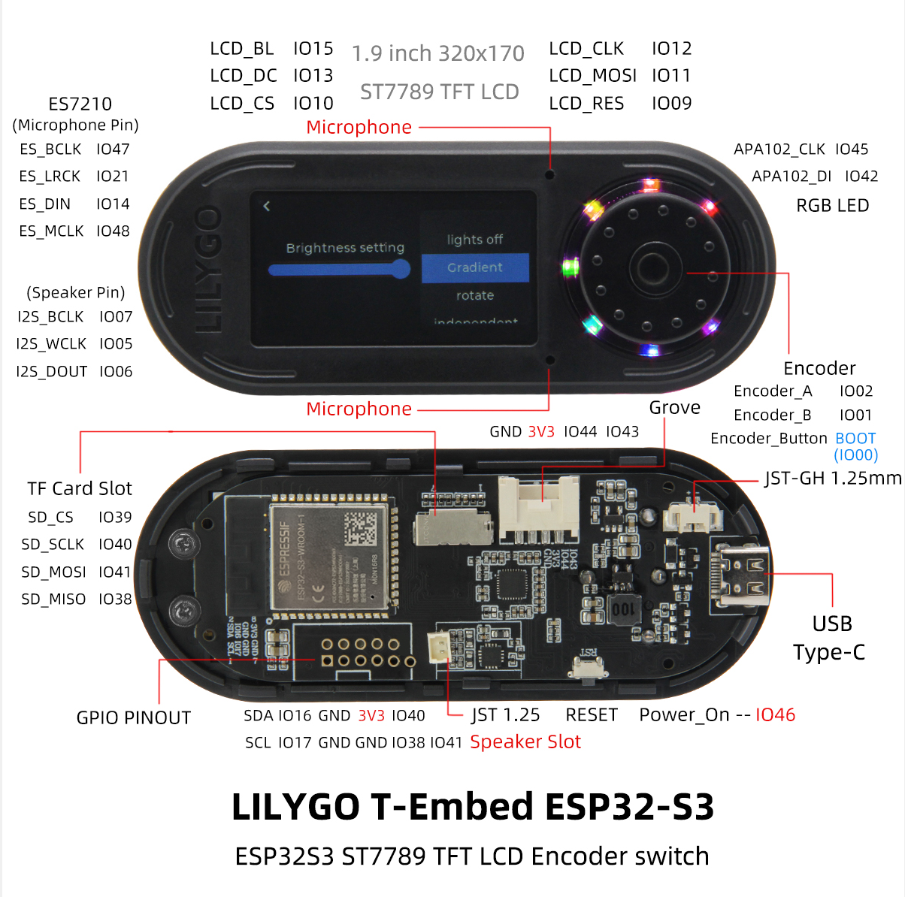
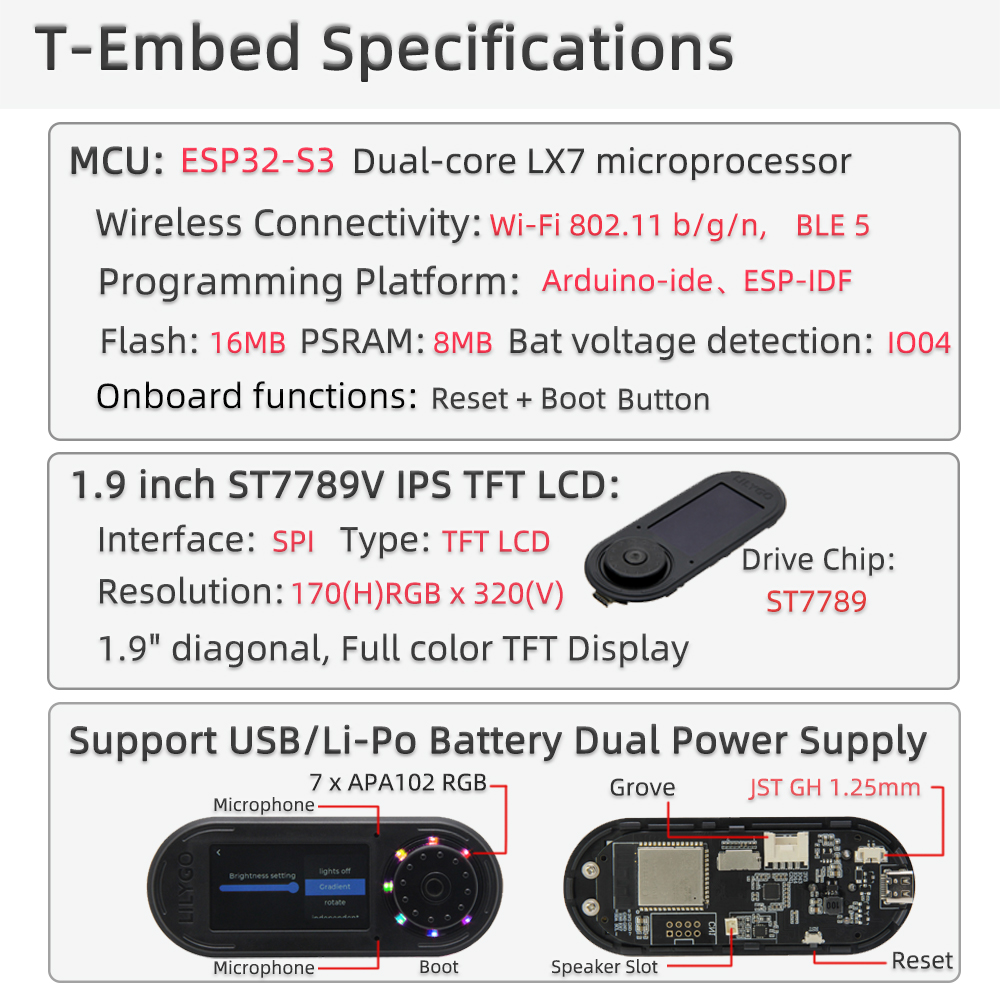
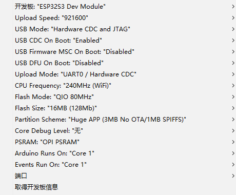

<h1 align = "center">🌟LilyGo T-Embed🌟</h1>

## News

- **CC1101 Shield Description**
  - If a CC1101 shield is added to the Embed, the microphone will not be enabled. This is determined by the hardware design and cannot be avoided.

# Introduce

An ESP32S3 development board that can freely use WIFI, BLE, TF, LED, TFT_LCD functions.

## Product 📷

| Product |  Product Link  |
| :-----: | :------------: |
| T-Embed | [LilyGo](https://www.lilygo.cc/products/t-embed) |

# Quick Start
## Arduino 
> Arduino:
>- Click "File" in the upper left corner -> Preferences -> Additional Development >Board Manager URL -> Enter the URL in the input box.
(ESP32S3 is a new chip, and the SDK version needs to be version 2.0.3 or above)
> `https://raw.githubusercontent.com/espressif/arduino-esp32/gh-pages/package_esp32_index.json`
>-  Click OK and the software will be installed by itself. After installation, restart the Arduino IDE software.
>- Search for ESP32 in Tools->Board Manager and install ESP32-Arduino SDK

>- Copy all files in the lib folder to `\Arduino\libraries`
>- Select the settings as shown. Note that the FLASH size partition and size may be modified depending on the board.

> PlatfromIO:
> - PlatformIO plug-in installation: Click on the extension on the left column -> search platformIO -> install the first plug-in
> - Click Platforms -> Embedded -> search Espressif 32 in the input box -> select the corresponding firmware installation

> ESP-IDF:
> - The installation method is also inconsistent depending on the system, it is recommended to refer to the [official manual](https://docs.espressif.com/projects/esp-idf/en/latest/esp32/get-started/index.html) for installation

## Precautions for factory example:
1. You need to use the [esp32fs plugin](https://github.com/me-no-dev/arduino-esp32fs-plugin/issues) . The `Arduino 2.x` version does not support the `esp32fs plugin`. Please use `Arduino 1.18.x` to upload resource files.Please refer to the plugin homepage for specific installation and usage methods
2. Please use <Arduino IDE 2.x> during compilation. Please refer to the following figure for specific options
    
3. The Arduino IDE prompts whether to update the library. Please do not click Upgrade, otherwise the configuration file of [TFT_ESPI] will be overwritten.

## Tips

1. The program can be written normally, but there is still no display after writing
    1. There are factory test files in the firmware folder, which can be flashed into the board to check whether the board is normal. If there is still no display, then it can be judged that there is a problem with the board or the screen
    2. Delete the <TFT_eSPI> in the libraries, and replace the <TFT_eSPI> in the <lib> folder of the main page to the libraries directory
    3. When opening the Arduino IDE, it prompts whether to upgrade the library, please choose not to upgrade, otherwise it will overwrite the configuration of the <TFT_eSPI> display

2. The board uses USB as the JTAG upload port. When printing serial port information on USB_CDC_ON_BOOT configuration needs to be turned on.
If the port cannot be found when uploading the program or the USB has been used for other functions, the port does not appear.
Please enter the upload mode manually.
   1. Connect the board via the USB cable
   2. Press and hold the BOOT(In the middle of the rotary encoder) button , While still pressing the BOOT button, press RST
   3. Release the RST
   4. Release the BOOT button
   5. Upload sketch

